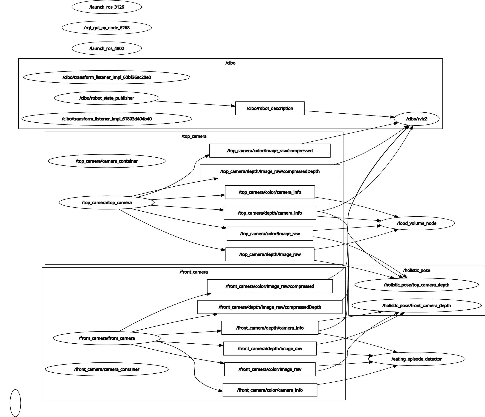

# cibo
[](https://docs.ros.org/en/jazzy/)

## 🚀 Overview
- Estimating human skeletal structure while eating.
- Estimating a person's state during meals.

## 📦 Feature
Eating Behavior Recognition for Elderly People.

### Node & Topic


## 🛠️ Setup
<details>

<summary>🛠️ Setup</summary>
 
### Setup Camera ([Astra Stereo S U3](https://store.orbbec.com/products/astra-stereo-s-u3?srsltid=AfmBOop-7Cnl_FU8fo6iytP43uBmOZTonKg5eosq_w3jRvFCeXtigKCG))

Please follow link  
[OrbbecSDK_ROS2](https://github.com/orbbec/OrbbecSDK_ROS2.git)
> [!IMPORTANT]
> branch: `main`  
> Use the `main` branch instead of the default `v2-main`  
> デフォルトの`v2-main`は使用しないで，`main` branchを使用する  
> 2025-10-14

### Installing dependent packages
### Setup cibo Repositories
Clone
```bash
cd ~/ros2_ws/src
git clone https://github.com/iHaruruki/cibo_ros2.git
```

Install `UV`
```bash
curl -LsSf https://astral.sh/uv/install.sh | sh
echo 'eval "$(uv generate-shell-completion bash)"' >> ~/.bashrc
echo 'eval "$(uvx --generate-shell-completion bash)"' >> ~/.bashrc
```
> [!TIP]
> - uvは，超高速なPythonパッケージマネージャ  
> - 仮想環境の作成・パッケージ管理・Pythonバージョン管理を一元化  
> [Installing uv](https://docs.astral.sh/uv/getting-started/installation/)

Install python packages
```bash
cd ~/ros2_ws/src/cibo_ros2/
uv sync
```

Install ros 2 packages
```bash
sudo apt install -y ros-$ROS_DISTRO-cv-bridge ros-$ROS_DISTRO-image-transport ros-$ROS_DISTRO-theora-image-transport ros-$ROS_DISTRO-image-transport-plugins ros-$ROS_DISTRO-message-filters ros-$ROS_DISTRO-ffmpeg-image-transport ros-$ROS_DISTRO-ffmpeg-image-transport-tools ros-$ROS_DISTRO-xacro ros-$ROS_DISTRO-urdf-tutorial
source /opt/ros/$ROS_DISTRO/setup.bash
```

Permission
```bash
cd ~/ros2_ws/src/cibo_ros2
sudo chmod +x scripts/*.py
```

Build
```bash
cd ~/ros2_ws
colcon build --symlink-install --packages-select cibo_ros2
source install/setup.bash
```

</details>

## 🎮 How to use
<details>

<summary>🎮 How to use</summary>

### Cibo 1

#### Checking inter-device communication connections / デバイス間通信の接続確認
Run publisher
```bash
# NUC36
ros2 run demo_nodes_cpp talker
```
Run subscriber
```bash
# NUC30
ros2 run demo_nodes_cpp listener
```
Result / 実行結果
```bash
$ ros2 run demo_nodes_cpp listener
[INFO] [1765264820.324285384] [listener]: I heard: [Hello World: 1]
[INFO] [1765264821.324176160] [listener]: I heard: [Hello World: 2]
[INFO] [1765264822.324076114] [listener]: I heard: [Hello World: 3]
[INFO] [1765264823.324220092] [listener]: I heard: [Hello World: 4]
[INFO] [1765264824.324185182] [listener]: I heard: [Hello World: 5]
```

Run Front camera
```bash
# NUC36
ros2 launch cibo_ros2 astra_stereo_u3.launch.py camera_name:=front_camera
```
Run mediapipe & TF
```bash
#NUC36
ros2 launch cibo_ros2 front_camera.launch.py
```
Run rviz2
```bash
#NUC36
ros2 launch cibo_ros2 rviz.launch.py
```
Run Food & Bite tracking
```bash
#NUC36
source ~/ros2_ws/src/cibo_ros2/.venv/bin/activate
ros2 run cibo_ros2 food_detection_and_access_tracking.py
```
Run chewing counter
```bash
#NUC36
source ~/ros2_ws/src/cibo_ros2/.venv/bin/activate
ros2 run cibo_ros2 htm_chewing.py
```
Run Top camera
```bash
# NUC30
ros2 launch cibo_ros2 astra_stereo_u3.launch.py camera_name:=top_camera
```
Run mediapipe
```bash
# NUC30
ros2 launch cibo_ros2 top_camera.launch.py 
```
Specify the area for skeleton estimation / 骨格推定を行う範囲を指定する
1. After launching the node, the OpenCV window will appear.  
    ノード起動後，OpenCVウィンドウが表示されます
2. Drag the mouse to specify the area for skeleton estimation.  
    マウスをドラッグして骨格推定を行う範囲を指定します
3. A blue rectangle will appear while you drag, and a green rectangle will appear after you confirm.  
    ドラッグ中は青い矩形が表示され，確定後は緑の矩形で表示されます

rosbag2を用いて，カメラ画像を録画する
```bash
#NUC36
cd ~/ros2_ws/rosbag
ros2 bag record --topics /front_camera/color/camera_info /front_camera/color/image_raw/compressed /front_camera/depth/camera_info /front_camera/depth/image_raw/compressedDepth /top_camera/color/camera_info /top_camera/color/image_raw/compressed /top_camera/depth/camera_info /top_camera/depth/image_raw/compressedDepth /tf /tf_static /cibo/joint_states /cibo/robot_description
```
録画した内容を確認する
```bash
#NUC36
cd ~/ros2_ws/rosbag
ros2 bag play <Pathを入力する>
```

### Cibo 2
#### Checking inter-device communication connections / デバイス間通信の接続確認
Run publisher
```bash
# NUC37
ros2 run demo_nodes_cpp talker
```
Run subscriber
```bash
# NUC32
ros2 run demo_nodes_cpp listener
```
Result / 実行結果
```bash
$ ros2 run demo_nodes_cpp listener
[INFO] [1765264820.324285384] [listener]: I heard: [Hello World: 1]
[INFO] [1765264821.324176160] [listener]: I heard: [Hello World: 2]
[INFO] [1765264822.324076114] [listener]: I heard: [Hello World: 3]
[INFO] [1765264823.324220092] [listener]: I heard: [Hello World: 4]
[INFO] [1765264824.324185182] [listener]: I heard: [Hello World: 5]
```

Run Front camera
```bash
# NUC37
ros2 launch cibo_ros2 astra_stereo_u3.launch.py camera_name:=front_camera
```
Run mediapipe & TF / 骨格推定
```bash
#NUC37
ros2 launch cibo_ros2 front_camera.launch.py
```
Run rviz2 / Face Mesh を表示
```bash
#NUC37
ros2 launch cibo_ros2 rviz.launch.py
```
Run Food & Bite tracking
```bash
#NUC37
source ~/ros2_ws/src/cibo_ros2/.venv/bin/activate
ros2 run cibo_ros2 food_detection_and_access_tracking.py
```
Run chewing counter
```bash
#NUC37
source ~/ros2_ws/src/cibo_ros2/.venv/bin/activate
ros2 run cibo_ros2 htm_chewing.py
```
```bash
#NUC37
ros2 launch cibo_ros2 front_camera.launch.py
```
```bash
#NUC37
ros2 launch cibo_ros2 rviz.launch.py
```
Run Top camera
```bash
#NUC32
ros2 launch cibo_ros2 astra_stereo_u3.launch.py camera_name:=top_camera
```
Run mediapipe / 骨格推定
```bash
# NUC32
ros2 launch cibo_ros2 top_camera.launch.py 
#NUC32
ros2 launch cibo_ros2 top_camera.launch.py
```

Specify the area for skeleton estimation / 骨格推定を行う範囲を指定する
1. After launching the node, the OpenCV window will appear.  
    ノード起動後，OpenCVウィンドウが表示されます
2. Drag the mouse to specify the area for skeleton estimation.  
    マウスをドラッグして骨格推定を行う範囲を指定します
3. A blue rectangle will appear while you drag, and a green rectangle will appear after you confirm.  
    ドラッグ中は青い矩形が表示され，確定後は緑の矩形で表示されます

rosbag2を用いて，カメラ画像を録画する
```bash
#NUC37
cd ~/ros2_ws/rosbag
ros2 bag record --topics /front_camera/color/camera_info /front_camera/color/image_raw/compressed /front_camera/depth/camera_info /front_camera/depth/image_raw/compressedDepth /top_camera/color/camera_info /top_camera/color/image_raw/compressed /top_camera/depth/camera_info /top_camera/depth/image_raw/compressedDepth /tf /tf_static /cibo/joint_states /cibo/robot_description
```
録画した内容を確認する
```bash
cd ~/ros2_ws/rosbag
ros2 bag play <Pathを入力する>
```

</details>


## rosbag2
<details>

<summary>rosbag2</summary>

1. rosbag2データを再生する
```bash
ros2 bag play $HOME/ros2_ws/rosbag/rosbag2_2026_08_25-17_37_46/
# rosbag path はご自身の環境に合わせて変更してください
```
2. 圧縮画像を解凍する
```bash
ros2 launch cibo_ros2 decompress_all_camera.launch.py
```
3. Run rviz2
```bash
ros2 launch cibo_ros2 rviz.launch.py
```
4. 骨格推定 & 咀嚼カウンタ & 摂食物推定

- Run mediapipe & TF
```bash
ros2 launch cibo_ros2 front_camera.launch.py
```
```bash
ros2 launch cibo_ros2 top_camera.launch.py 
```
- Run Food & Bite tracking
```bash
source ~/ros2_ws/src/cibo_ros2/.venv/bin/activate
ros2 run cibo_ros2 food_detection_and_access_tracking.py
```
- Run chewing counter
```bash
source ~/ros2_ws/src/cibo_ros2/.venv/bin/activate
ros2 run cibo_ros2 htm_chewing.py
```

</details>

## Tutorial

<details>

<summary>Pythonサンプルプログラム</summary>

1. 新しいPythonファイルを作成する
`~/ros2_ws/src/cibo_ros2/scripts/imshow.py`
```python
#!/usr/bin/env python3

import rclpy
from rclpy.node import Node
from sensor_msgs.msg import Image
from cv_bridge import CvBridge
import cv2
import numpy as np
from message_filters import ApproximateTimeSynchronizer, Subscriber
from rclpy.qos import QoSProfile, ReliabilityPolicy, HistoryPolicy

class CameraImageDisplay(Node):
    def __init__(self):
        super().__init__('camera_image_display')

        # CvBridgeのインスタンスを作成
        self.bridge = CvBridge()

        # QoS設定をbest_effortに変更
        qos_profile = QoSProfile(
            reliability=ReliabilityPolicy.BEST_EFFORT,
            history=HistoryPolicy.KEEP_LAST,
            depth=10
        )

        # FRONTカメラの画像トピックをサブスクライブ
        front_color_sub = Subscriber(self, Image, '/front_camera/color/image_raw', qos_profile=qos_profile)
        front_depth_sub = Subscriber(self, Image, '/front_camera/depth/image_raw', qos_profile=qos_profile)
        
        # TOPカメラの画像トピックをサブスクライブ
        top_color_sub = Subscriber(self, Image, '/top_camera/color/image_raw', qos_profile=qos_profile)
        top_depth_sub = Subscriber(self, Image, '/top_camera/depth/image_raw', qos_profile=qos_profile)

        # 全カメラのメッセージ同期（FRONT color, FRONT depth, TOP color, TOP depth）
        self.camera_sync = ApproximateTimeSynchronizer(
            [front_color_sub, front_depth_sub, top_color_sub, top_depth_sub],
            queue_size=50,
            slop=0.5
        )
        self.camera_sync.registerCallback(self.camera_callback)

        # ウィンドウ名を設定
        cv2.namedWindow("FRONT Camera Color", cv2.WINDOW_NORMAL)
        cv2.namedWindow("FRONT Camera Depth", cv2.WINDOW_NORMAL)
        cv2.namedWindow("TOP Camera Color", cv2.WINDOW_NORMAL)
        cv2.namedWindow("TOP Camera Depth", cv2.WINDOW_NORMAL)

    def camera_callback(self, front_color_msg, front_depth_msg, top_color_msg, top_depth_msg):
        try:
            # FRONTカメラのカラー画像処理
            front_color_image = self.bridge.imgmsg_to_cv2(front_color_msg, desired_encoding='bgr8')
            cv2.imshow("FRONT Camera Color", front_color_image)
            
            # FRONTカメラの深度画像処理
            front_depth_image = self.bridge.imgmsg_to_cv2(front_depth_msg, desired_encoding='passthrough')
            front_depth_normalized = cv2.normalize(front_depth_image, None, 0, 255, cv2.NORM_MINMAX)
            front_depth_8bit = cv2.convertScaleAbs(front_depth_normalized)
            front_depth_colored = cv2.applyColorMap(front_depth_8bit, cv2.COLORMAP_JET)
            cv2.imshow("FRONT Camera Depth", front_depth_colored)

            # TOPカメラのカラー画像処理
            top_color_image = self.bridge.imgmsg_to_cv2(top_color_msg, desired_encoding='bgr8')
            cv2.imshow("TOP Camera Color", top_color_image)
            
            # TOPカメラの深度画像処理
            top_depth_image = self.bridge.imgmsg_to_cv2(top_depth_msg, desired_encoding='passthrough')
            top_depth_normalized = cv2.normalize(top_depth_image, None, 0, 255, cv2.NORM_MINMAX)
            top_depth_8bit = cv2.convertScaleAbs(top_depth_normalized)
            top_depth_colored = cv2.applyColorMap(top_depth_8bit, cv2.COLORMAP_JET)
            cv2.imshow("TOP Camera Depth", top_depth_colored)
            
            cv2.waitKey(1)
        except Exception as e:
            self.get_logger().error(f"Error processing camera images: {e}")

def main(args=None):
    rclpy.init(args=args)
    node = CameraImageDisplay()

    try:
        rclpy.spin(node)
    except KeyboardInterrupt:
        pass
    finally:
        cv2.destroyAllWindows()
        node.destroy_node()
        rclpy.shutdown()

if __name__ == '__main__':
    main()
```

2. `CMakeLists.txt`を編集する
```cmake
cmake_minimum_required(VERSION 3.8)
project(cibo_ros2)

if(CMAKE_COMPILER_IS_GNUCXX OR CMAKE_CXX_COMPILER_ID MATCHES "Clang")
  add_compile_options(-Wall -Wextra -Wpedantic)
endif()

# find dependencies
find_package(ament_cmake REQUIRED)
find_package(ament_cmake_python REQUIRED)
find_package(rclpy REQUIRED)

# Install Python modules
ament_python_install_package(${PROJECT_NAME} PACKAGE_DIR src/${PROJECT_NAME})

# Install Python executables
install(
  PROGRAMS
    scripts/check_image_compressed.py
    scripts/dual_camera_sync.py
    scripts/front_camera_depth.py
    scripts/front_camera.py
    scripts/image_show.py
    scripts/top_camera_depth.py
    scripts/top_camera.py
    scripts/food_detection_and_access_tracking.py
    scripts/htm_chewing.py
    scripts/imshow.py ##### 追加する #####
  DESTINATION lib/${PROJECT_NAME}
)

install(DIRECTORY launch rviz urdf models
  DESTINATION share/${PROJECT_NAME}
)

install(FILES
  pyproject.toml
  DESTINATION share/${PROJECT_NAME}
)

if(BUILD_TESTING)
  find_package(ament_lint_auto REQUIRED)
  # the following line skips the linter which checks for copyrights
  # comment the line when a copyright and license is added to all source files
  set(ament_cmake_copyright_FOUND TRUE)
  # the following line skips cpplint (only works in a git repo)
  # comment the line when this package is in a git repo and when
  # a copyright and license is added to all source files
  set(ament_cmake_cpplint_FOUND TRUE)
  ament_lint_auto_find_test_dependencies()
endif()

ament_package()
```

3. 実行権限を付与する
```bash
sudo chmod 777 ~/ros2_ws/src/cibo_ros2/scripts/imshow.py
```

4. Buildする
```bash
colcon build --symlink-install --packages-select cibo_ros2
```

5. 実行する  
仮想環境を読み込む
```bash
source ~/ros2_ws/src/cibo_ros2/.venv/bin/activate
```
ROS2 Nodeを実行する
```bash
ros2 run cibo_ros2 imshow.py
```

</details>

## 👤 Authors
- **[iHaruruki](https://github.com/iHaruruki)** — Main author & maintainer

## 📚 Reference
ROS2
- [ROS 2-Jazzy](https://docs.ros.org/en/jazzy/index.html)
- [ROS 2 Installation](https://docs.ros.org/en/jazzy/Installation/Ubuntu-Install-Debs.html)

Mediapipe Face Mesh
- [MediaPipe](https://chuoling.github.io/mediapipe/)
- [Face landmark detection guide](https://ai.google.dev/edge/mediapipe/solutions/vision/face_landmarker?utm_source=chatgpt.com)
- [MediaPipe Face Mesh](https://mediapipe.readthedocs.io/en/latest/solutions/face_mesh.html?utm_source=chatgpt.com)
- [Facial landmark detection made easy with MediaPipe](https://www.samproell.io/posts/yarppg/yarppg-face-detection-with-mediapipe/?utm_source=chatgpt.com)

MediaPipe Holistic
- [MediaPipe](https://chuoling.github.io/mediapipe/)
- [Holistic Landmarker](https://ai.google.dev/edge/mediapipe/solutions/vision/holistic_landmarker?utm_source=chatgpt.com)
- [MediaPipe Holistic — Simultaneous Face, Hand and Pose Prediction, on Device](https://research.google/blog/mediapipe-holistic-simultaneous-face-hand-and-pose-prediction-on-device/?utm_source=chatgpt.com)
- [MediaPipe Holistic](https://github.com/google-ai-edge/mediapipe/blob/master/docs/solutions/holistic.md)

MediaPipe Pose
- [Pose landmark detection guide](https://ai.google.dev/edge/mediapipe/solutions/vision/pose_landmarker?utm_source=chatgpt.com)

OrbbecSDK_ROS2
- [Available Topics](https://orbbec.github.io/OrbbecSDK_ROS2/en/source/4_application_guide/topics.html)
- [Launch parameters](https://orbbec.github.io/OrbbecSDK_ROS2/en/source/4_application_guide/launch_parameters.html)
- [Multi-Camera](https://orbbec.github.io/OrbbecSDK_ROS2/en/source/5_advanced_guide/multi_camera/multi_camera.html)
- [Aligning Depth to Color in ROS 2](https://orbbec.github.io/OrbbecSDK_ROS2/en/source/5_advanced_guide/configuration/align_depth_color.html)

Orbbec Astra Stereo S U3
- [OrbbecSDK_ROS2_Docs](https://github.com/orbbec/OrbbecSDK_ROS2_Docs.git)

Cameras and Calibration
- [Cameras and CalibrationGetting Setup](https://industrial-training-master.readthedocs.io/en/latest/_source/session9/Cameras-and-Calibration.html)
- [robot_cal_tools](https://github.com/Jmeyer1292/robot_cal_tools.git)

ROS 2 message_filters
- [message_filters](https://docs.ros.org/en/rolling/p/message_filters/doc/index.html)
- [ROS 2（rolling）のPythonチュートリアル](https://docs.ros.org/en/rolling/p/message_filters/doc/Tutorials/Approximate-Synchronizer-Python.html?utm_source=chatgpt.com)

CV Bridge
- [Converting between ROS images and OpenCV images](https://wiki.ros.org/cv_bridge/Tutorials/ConvertingBetweenROSImagesAndOpenCVImagesPython?utm_source=chatgpt.com)
- [image_pipeline](https://docs.ros.org/en/rolling/p/image_pipeline/camera_info.html)
- [Converting between ROS images and OpenCV images (Python)](https://wiki.ros.org/cv_bridge/Tutorials/ConvertingBetweenROSImagesAndOpenCVImagesPython?utm_source=chatgpt.com)
- [image_pipeline](https://docs.ros.org/en/rolling/p/image_pipeline/camera_info.html)

Image Compression
- [ffmpeg_image_transport](https://index.ros.org/p/ffmpeg_image_transport/)
- [ROS2 image transport for ffmpeg/libav](https://docs.ros.org/en/jazzy/p/ffmpeg_image_transport/doc/readme_include.html)
- [ROS 2のffmpeg_image_transportパッケージを使って効率よく画像トピックを配信、購読する](https://qiita.com/dandelion1124/items/deed014872624fd9a50c)

YOLO
- [YOLO-Worldモデル](https://docs.ultralytics.com/ja/models/yolo-world)

supervision
- [supervision](https://supervision.roboflow.com/latest/)

tf2_ros / TransformBroadcaster（Python）
- [Writing a broadcaster (Python)](https://docs.ros.org/en/foxy/Tutorials/Intermediate/Tf2/Writing-A-Tf2-Broadcaster-Py.html?utm_source=chatgpt.com)
- [Writing a tf2 broadcaster (Python)[ROS1]](https://wiki.ros.org/tf2/Tutorials/Writing%20a%20tf2%20broadcaster%20%28Python%29?utm_source=chatgpt.com)

Mermaid
- [Mermaid](https://mermaid.js.org/)
- [mermaidでフローチャートを描く](https://zenn.dev/yuriemori/articles/e097dbd950df86#%E5%9B%B3%E3%81%AE%E7%A8%AE%E9%A1%9E)

LaTex
- [はじめてのLaTex: 数式の入力と環境構築](https://guides.lib.kyushu-u.ac.jp/LaTeX-LectureNote/equations)
- [LaTex - コマンド一覧](https://yokatoki.sakura.ne.jp/LaTeX/latex.html)
- [数式の記述(markdown)](https://docs.github.com/ja/enterprise-cloud@latest/get-started/writing-on-github/working-with-advanced-formatting/writing-mathematical-expressions)
